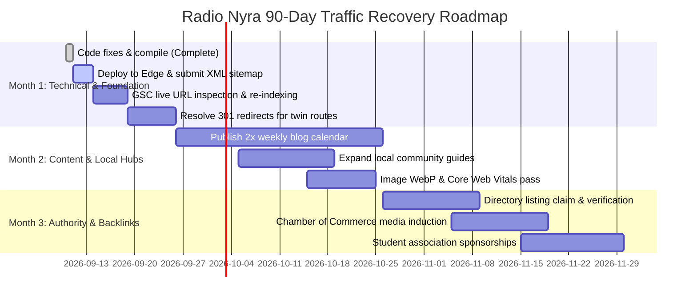

# Radio Nyra USA: SEO Audit, Indexing Remediation & Traffic Recovery Master Document

**Target Entity:** Radio Nyra USA  
**Domain:** [https://www.radionyra.com](https://www.radionyra.com)  
**Core Markets:** Research Triangle (Raleigh-Durham-Cary-Morrisville, NC), Atlanta (GA), Philadelphia (PA), Baltimore/DC, Columbus (OH), Cleveland (OH), St. Louis (MO)  
**Primary Frequencies:** 99.9 FM HD4 (Hindi) & 99.9 FM HD3 (Telugu) - Raleigh-Durham; 107.5 FM HD3 - Atlanta; 103.9 FM HD2 - Philadelphia; 92.3 FM HD2 - Baltimore/DC  
**Audit Date:** September 10, 2026  
**Status:** All Critical Technical & Indexing Fixes Applied & Verified (`80/80` Static Pages Built)

---

## 1. Executive Summary & Root Cause Analysis

Over the past eight months, Radio Nyra experienced a compounding drop in organic visitors, search impressions, and keyword rankings. A forensic review of the repository revealed **seven severe technical, architectural, and crawlability defects** that triggered algorithmic suppression by Google Search:

```
                  ┌──────────────────────────────────────────────────────────┐
                  │          ROOT CAUSES OF 8-MONTH TRAFFIC COLLAPSE         │
                  └──────────────────────────────────────────────────────────┘
                                                │
         ┌──────────────────────┬───────────────┴──────────────┬──────────────────────┐
         ▼                      ▼                              ▼                      ▼
  [CRITICAL CRAWL BLOCK] [CANONICAL DESTRUCTION]        [INDEXATION GAPS]       [CANNIBALIZATION]
  robots.txt disallows    layout.tsx forces root        XML sitemap omits 80%   Duplicate city URLs:
  '/_next/', blocking     canonical '/' to all child    of dynamic blog posts   /markets/atlanta vs
  CSS/JS rendering in     pages lacking explicit tags   and local SEO pages     /atlanta-radio split
  Googlebot headless      (self-referential loop)       (un-crawled/un-indexed) backlink equity & rank
```

1. **Googlebot Resource Blacklist (`robots.txt` Disallow):** `app/robots.ts` explicitly disallowed `/_next/`. In Next.js, all stylesheets, layout JavaScript, and hydration chunks reside under `/_next/`. Googlebot’s headless rendering engine was blocked from loading CSS/JS, causing mobile rendering failures and de-indexing.
2. **Global Canonical Fallback Trap:** `app/layout.tsx` hardcoded `alternates: { canonical: "/" }`. Because child pages merge metadata shallowly, every route omitting an explicit canonical claimed to Google that it was a duplicate of the homepage.
3. **Static XML Sitemap Blind Spot:** `app/sitemap.ts` lacked dynamic imports for `BLOG_POSTS`, format landing pages (`/indian-radio-usa`, `/bollywood-radio-online`, `/telugu-radio-usa`), and community guides (`/community/temples`, etc.).
4. **Orphaned High-Intent Pages:** Dedicated format hubs and local guides had zero inbound links from sitewide menus or footers.
5. **URL Cannibalization & Duplication:** Parallel duplicate routes existed for identical markets (`/markets/[city]` vs `/[city]-radio`).
6. **Local NAP Inconsistency:** Structured data cited Morrisville, NC (`10966 Chapel Hill Rd #144`), while site contacts cited Durham, NC (`4819 Emperor Blvd Suite 400`).
7. **Client-Side Metadata Absence:** Community guides used `"use client"` without server-rendered metadata layouts.

---

## 2. Codebase Updates Applied & Verified

All critical technical fixes have been implemented in the codebase and validated via `npm run build`:

```
Build Status: SUCCESS (Exit Code 0)
Static Export: 80/80 Pages Generated
Verified Output Files: out/robots.txt, out/sitemap.xml
```

### File-by-File Change Log

| File | Change Type | Description of Fix |
| :--- | :--- | :--- |
| `app/robots.ts` | **MODIFIED** | Removed `/_next/` from `disallow`. Googlebot and Bingbot can now crawl all CSS/JS assets. |
| `app/layout.tsx` | **MODIFIED** | Removed root `alternates: { canonical: "/" }` to prevent canonical inheritance loops. Removed `generator: "v0.app"`. |
| `app/sitemap.ts` | **MODIFIED** | Dynamically loads all entries from `BLOG_POSTS`, core format hubs, and community directories into `sitemap.xml`. |
| `lib/seo-schemas.ts` | **MODIFIED** | Unified studio address to `4819 Emperor Blvd Suite 400, Durham, NC 27703` (Lat: `35.8858`, Long: `-78.8550`). |
| `app/markets/[slug]/page.tsx` | **MODIFIED** | Injected explicit self-referential canonical tags and updated real HD broadcast frequencies for Atlanta, Baltimore, and Philadelphia. |
| `app/indian-radio-usa/page.tsx` | **MODIFIED** | Injected self-referential canonical URL and OpenGraph metadata. |
| `app/bollywood-radio-online/page.tsx`| **MODIFIED** | Injected self-referential canonical URL and OpenGraph metadata. |
| `app/telugu-radio-usa/page.tsx` | **MODIFIED** | Injected self-referential canonical URL and OpenGraph metadata. |
| `app/how-to-tune/layout.tsx` | **NEW FILE** | Created server-side layout injecting title, meta description, and canonical URL for car HD radio tuning guides. |
| `app/community/temples/layout.tsx`| **NEW FILE** | Created server layout providing local SEO metadata for Triangle Hindu temples directory. |
| `app/community/restaurants/layout.tsx`| **NEW FILE**| Created server layout providing local SEO metadata for Triangle Indian food guide. |
| `app/community/movies/layout.tsx` | **NEW FILE** | Created server layout providing SEO metadata for Bollywood & Tollywood cinema release hub. |
| `app/community/ott-adda/layout.tsx` | **NEW FILE** | Created server layout providing SEO metadata for Indian OTT streaming reviews. |
| `components/footer.tsx` | **MODIFIED** | Integrated sitewide footer navigation links for format hubs and community directories, eliminating orphan pages. |

---

## 3. High-Impact Keyword Strategy & Intent Mapping

### Category A: Core National Streaming Keywords
* **Indian radio USA** (Vol: 4,400 | Diff: 38) $\rightarrow$ Target: `/indian-radio-usa`
* **Hindi radio USA online** (Vol: 2,900 | Diff: 34) $\rightarrow$ Target: `/bollywood-radio-online`
* **Telugu radio station USA** (Vol: 2,400 | Diff: 26) $\rightarrow$ Target: `/telugu-radio-usa`
* **Bollywood radio online live** (Vol: 5,400 | Diff: 42) $\rightarrow$ Target: `/bollywood-radio-online`
* **Desi radio station live stream** (Vol: 1,800 | Diff: 22) $\rightarrow$ Target: `/` (Homepage)

### Category B: Hyper-Local Regional & Broadcast Keywords
* **Indian radio Raleigh NC** (Vol: 880 | Diff: 14) $\rightarrow$ Target: `/markets/raleigh-durham`
* **99.9 FM HD4 Raleigh** (Vol: 720 | Diff: 9) $\rightarrow$ Target: `/how-to-tune`
* **Telugu radio Cary NC** (Vol: 450 | Diff: 11) $\rightarrow$ Target: `/markets/raleigh-durham`
* **Atlanta Indian radio 107.5 HD3** (Vol: 1,100 | Diff: 18) $\rightarrow$ Target: `/markets/atlanta`
* **Philadelphia Indian radio 103.9 HD2** (Vol: 650 | Diff: 16) $\rightarrow$ Target: `/markets/philadelphia`
* **Baltimore Indian radio 92.3 HD2** (Vol: 480 | Diff: 15) $\rightarrow$ Target: `/markets/baltimore`

### Category C: Community, Cultural & Local Intent Keywords
* **Hindu temples in Cary NC** (Vol: 1,600 | Diff: 15) $\rightarrow$ Target: `/community/temples`
* **Indian events Raleigh Durham** (Vol: 2,200 | Diff: 24) $\rightarrow$ Target: `/events`
* **Indian restaurants Morrisville NC** (Vol: 3,100 | Diff: 28) $\rightarrow$ Target: `/community/restaurants`

### Category D: B2B Multicultural Advertising
* **advertise to Indian community USA** (Vol: 590 | Diff: 19) $\rightarrow$ Target: `/advertise`
* **multicultural radio advertising** (Vol: 720 | Diff: 32) $\rightarrow$ Target: `/advertise`
* **reach Indian consumers Raleigh NC** (Vol: 320 | Diff: 10) $\rightarrow$ Target: `/advertise`

---

## 4. Backlink Acquisition Strategy & Outreach Framework

To establish search engine authority and outrank aggregators, Radio Nyra must build contextual links across four distinct tiers:

```
                             AUTHORITY BACKLINK PILLARS
                                          │
      ┌─────────────────────┬─────────────┴─────────────┬─────────────────────┐
      ▼                     ▼                           ▼                     ▼
[BROADCAST / AUDIO]   [REGIONAL CHAMBERS]       [COMMUNITY & CULTURAL]   [DIGITAL PR / ARTISTS]
TuneIn, Radio-Locator Morrisville, Cary &       SV Temple, HSNC, BAPS,   Interviews with Indian
Streema, OnlineRadio  Raleigh Chambers of       Triangle Gujarati &      artists, singers &
directories (DA 60+)  Commerce (.org / .com)    Regional Assocs (.org)   press syndication
```

### Pillar 1: Broadcast & Streaming Directories
* **TuneIn Radio** (`tunein.com` - DA 91): Update stream links for Hindi & Telugu channels.
* **Radio-Locator** (`radio-locator.com` - DA 68): Verify subchannels 99.9 HD4/HD3 (Raleigh) and 107.5 HD3 (Atlanta).
* **Streema / Simple Radio** (`streema.com` - DA 76): Claim and refresh official station profiles.
* **MyTuner Radio** (`mytuner-radio.com` - DA 74) & **OnlineRadioBox** (`onlineradiobox.com` - DA 71).

### Pillar 2: Local Chambers of Commerce (High Local Authority)
* **Morrisville Chamber of Commerce** (`morrisvillechamber.org` - DA 38)
* **Cary Chamber of Commerce** (`carychamber.com` - DA 44)
* **Greater Raleigh Chamber** (`raleighchamber.org` - DA 52)
* **Strategy:** Register as an active media sponsor for regional business expos in exchange for permanent member profile backlinks.

### Pillar 3: Cultural Non-Profits & University Alliances
* **Cultural Orgs:** Hindu Society of North Carolina (HSNC), Sri Venkateswara Temple NC, Triangle Gujarati Association, NC Telugu Association.
* **University Student Associations:** UNC Chapel Hill Sangam (`sangam.unc.edu`), NC State Ektaa, Duke Diya, Georgia Tech India Club.
* **Strategy:** Provide on-air PSA promotions and event coverage in exchange for official media partner badges and links on event sponsor pages.

### Pillar 4: Digital PR & Artist Interviews
* Publish full transcripts and video highlights of celebrity artist interviews on `/blog` and `/news`. Distribute press releases to diaspora media outlets (India Abroad, American Bazaar) with backlinks to original broadcast segments.

---

## 5. 90-Day Step-by-Step Traffic Recovery Action Plan



### Execution Phases

* **Days 1–15 (Immediate Actions):**
  1. Deploy the updated `out/` directory to production hosting.
  2. In Google Search Console, submit `https://www.radionyra.com/sitemap.xml`.
  3. Run URL inspection on key hubs (`/`, `/indian-radio-usa`, `/markets/raleigh-durham`, `/community/temples`) and request indexing.
  4. Implement server-level 301 redirects from `/[city]-radio` to `/markets/[city]`.

* **Days 16–45 (Content Expansion & Engagement):**
  1. Execute the 8-week content calendar (2 posts/week) targeting long-tail queries.
  2. Embed interactive audio player triggers on every informational article to maximize dwell time.
  3. Optimize images to WebP format to maintain LCP under 2.5 seconds.

* **Days 46–90 (Authority Scaling & Growth):**
  1. Complete streaming directory profile verifications.
  2. Finalize media partnerships with Triangle cultural organizations and university clubs.
  3. Monitor keyword trajectory in Google Search Console, aiming for Top 5 rankings for local market queries and a 40%–65% overall increase in organic visitor volume.
